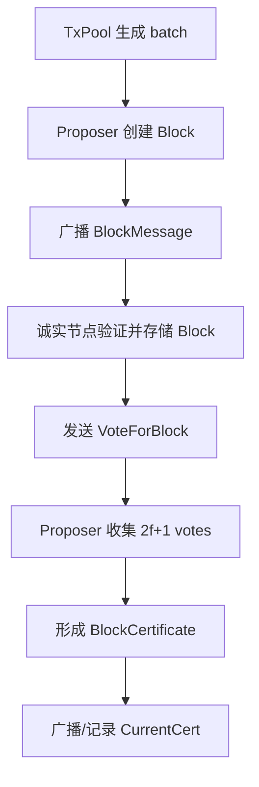

# 012-Certified Blocks

`011-ACS` 使用 `RBC + BBA` 在每个 epoch 中决定一组 batch。这个章节先不进入 MVBA，而是只做 Dumbo-NG 的第一步：把数据传播从共识选择中拆出来，形成连续运行的数据平面。

本章代码是一个小型教学模拟器：节点持续创建 block，其他节点投票，proposer 收集 `2f+1` 个 vote 后形成 block certificate。

## 为什么要有 012

在 ACS 中，数据传播和共识决定绑在一起：

```text
batch -> RBC -> BBA -> ACS output -> commit
```

Dumbo-NG 的思路是拆成两层：

```text
数据平面（连续多轮 broadcast 产生可证明的 broadcast certificates）：BlockMessage -> VoteForBlock -> BlockCertificate
控制平面（反复运行带 quality 的 MVBA，对这些 certificates 的 frontier 做全序排序）：对 certified frontier 运行 sMVBA
```

`012` 只实现第一层。它能告诉我们每个 proposer 最新 certified 到哪个高度，但还不负责全局提交顺序。

## 协议流程



## 核心类型

```text
Block
  proposer
  height
  prev_hash
  batch

VoteForBlock
  voter
  proposer
  height
  block_hash

BlockCertificate
  proposer
  height
  block_hash
  voters >= 2f+1

CurrentCert
  map[proposer] -> latest certified height/hash
```

这些类型对应 `014-DumboNG` 里的数据平面概念：

- `BlockMessage`
- `VoteforBlock`
- `CertForBlockData`
- `CurrentCert`

## 运行

在仓库模块目录下执行：

```bash
go run ./012-ACS --nodes 4 --faults 1 --rounds 3 --batch-size 2
```

输出示例：

```text
012 Certified Blocks data plane
nodes=4 faults=1 high_threshold=3 rounds=3 batch_size=2
certificates=9

Recent certificates:
  proposer=1 height=1 hash=... voters=[1 2 3]
  proposer=2 height=1 hash=... voters=[1 2 3]
  proposer=3 height=1 hash=... voters=[1 2 3]

Certified frontiers observed by honest nodes:
  node 1: p0->h0 p1->h3 p2->h3 p3->h3
  node 2: p0->h0 p1->h3 p2->h3 p3->h3
  node 3: p0->h0 p1->h3 p2->h3 p3->h3
```

输出完整 JSON：

```bash
go run ./012-ACS --json
```

## 这一章不解决什么

`012` 形成的是局部可观察的 certificate frontier：

```text
node i 认为：proposer j 最新 certified 到 height h
```

但是异步网络里，不同节点看到的 frontier 可能不同。也就是说，`012` 还没有保证所有诚实节点提交相同的 block 集合和顺序。

这个问题留给 `013-sMVBA`：

```text
输入：多个节点各自观察到的 CurrentCert frontier
输出：所有诚实节点决定同一个 frontier
```

## 测试

```bash
go test ./012-ACS/...
```
