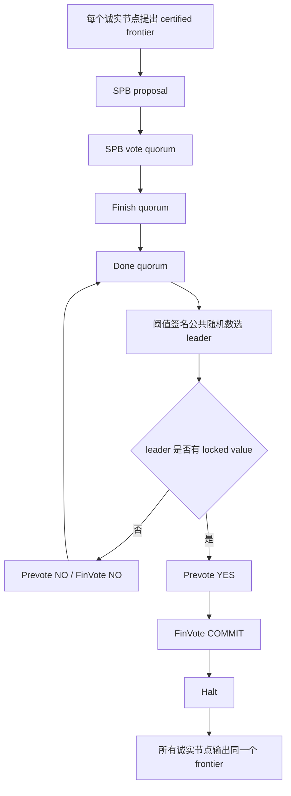

# 013-sMVBA

`012-Certified Blocks` 已经把交易数据传播拆成了独立数据平面：每个 proposer 可以持续产生 certified blocks。

但这还不够。异步网络里，不同节点看到的 `CurrentCert` frontier 可能不同。`013` 的目标是用 sMVBA 对其中一个有效 frontier 达成一致。

本章代码是一个小型教学模拟器，重点展示 sMVBA 的控制流程，而不是完整网络和真实阈值签名。完整工程化版本在 `014-DumboNG`。

## 输入和输出

输入是每个节点提出的 certified frontier：

```go
type Value struct {
    Proposer NodeID
    Epoch    int
    Frontier map[NodeID]CertForBlockData
}
```

其中 `CertForBlockData` 来自 `012`：

```go
type CertForBlockData struct {
    Height int
    Hash   string
}
```

sMVBA 的输出是所有诚实节点决定同一个 `Value`。

```text
多个候选 frontier -> sMVBA -> 一个被全网决定的 frontier
```

## 协议流程



## 和 ACS 的区别

`011-ACS` 的做法是：

```text
N 个 RBC + N 个 BBA -> 一个 batch 子集
```

`sMVBA` 的做法是：

```text
多个节点提出候选 frontier -> 通过 leader/投票选择一个有效 frontier
```

这使得最终 `014-DumboNG` 可以：

1. 让数据平面持续产生 certified blocks；
2. 周期性用 sMVBA 决定提交边界；
3. 避免 ACS epoch 串行阻塞数据传播。

## 运行

```bash
go run ./013-sMVBA --nodes 4 --faults 1
```

默认情况下，节点 `0` 被模拟为故障节点。第 `0` 轮公共随机数选到 leader `0` 时没有可锁定值，因此进入下一轮；第 `1` 轮选到 leader `1` 后决定 leader `1` 的 frontier。

输出示例：

```text
013 sMVBA control plane
nodes=4 faults=1 high_threshold=3 epoch=0
decided proposer=1 value=...

Trace:
  e0/r0 skip_faulty_spb node=0
  e0/r0 spb_proposal     node=1 value=...
  e0/r0 spb_vote_quorum  node=1 value=... 3 votes
  e0/r0 finish_quorum    node=1 value=... 3 finish
  e0/r0 threshold_coin   leader=0
  e0/r0 prevote_no       leader=0 leader has no locked SPB value
  e0/r0 finvote_no       leader=0 advance to next round
  e0/r1 threshold_coin   leader=1
  e0/r1 prevote_yes      leader=1 value=... 3 yes votes
  e0/r1 finvote_commit   leader=1 value=... 3 commit votes
  e0/r1 halt             leader=1 value=...
```

输出完整 JSON：

```bash
go run ./013-sMVBA --json
```

## 本章的简化点

为了突出控制平面，`013` 有意简化了几件事：

- 使用可复现的确定性 leader 选择代替真实 threshold coin；
- 用内存事件模拟消息广播；
- SPB、Finish、Done、Prevote、FinVote、Halt 都保留协议阶段，但不实现真实签名网络。

`014-DumboNG` 会把这些概念替换成真实模块：

- `crypto.SigService` 和阈值签名；
- `network.Sender` / `network.Receiver`；
- `core.Transmitor`；
- `core/smvba/consensus` 中的 SPB、Elector、Aggreator 和 Committer。

## 测试

```bash
go test ./013-sMVBA/...
```
